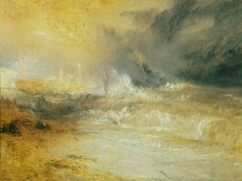
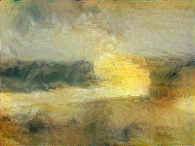

# Neural Style Transfer

Example of Neural Style Transfer, based on Code from Andrew Ng's Course 'Convolutional Neural Networks". The pre-trained model should be downloaded from http://www.vlfeat.org/matconvnet/models/imagenet-vgg-verydeep-19.mat (500MB) and stored in the folder "pre-trained model".

# Input file

    

# Style Image

    

# Output Image

    

